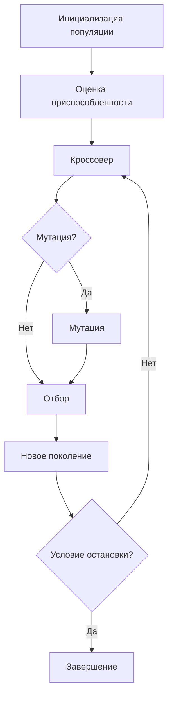

# 2. Что такое генетические алгоритмы

## Введение: что такое генетические алгоритмы и зачем они нужны

**Генетический алгоритм (ГА)** – это разновидность алгоритмов оптимизации, вдохновлённая идеями эволюционной биологии и естественного отбора. Проще говоря, ГА имитирует процесс эволюции: у нас есть множество потенциальных решений задачи (аналог популяции организмов), эти решения эволюционируют через итерации, «скрещиваясь» и мутируя, и со временем улучшаются по качеству согласно некоторому критерию. Алгоритм периодически отбирает более удачные решения (как выживание наиболее приспособленных) и на их основе генерирует новые решения. В результате за несколько поколений находится решение, близкое к оптимальному.

ГА применяется для поиска приближённых решений в задачах, где перебор всех вариантов затруднён. Классические примеры – задачи оптимизации (например, комбинаторные задачи или подбор параметров), где нужно максимизировать или минимизировать некоторую целевую функцию, а прямых методов найти оптимум нет. Вместо того чтобы перебирать все варианты, ГА быстро эволюционирует решения, приближаясь к оптимальным. Это актуально в сложных задачах, например, при планировании маршрутов, составлении расписаний, оптимизации инженерных конструкций и т.д. Генетические алгоритмы относятся к семейству _эволюционных алгоритмов_ – методов, решающих задачи оптимизации на основе имитации эволюционных процессов (наряду с, например, эволюционными стратегиями и генетическим программированием).

## Исторический контекст

Идея использовать принципы природной эволюции для решения инженерных задач возникла в середине XX века. В 1950-х проводились первые эксперименты по имитации эволюции на компьютерах. Но настоящую популярность генетические алгоритмы получили благодаря работам Джона Холланда в 1970-х годах. Холланд и его соратники формализовали ГА и показали, как принципы отбора, скрещивания и мутаций можно применять к широкому кругу задач. В 1975 году Холланд опубликовал книгу _"Adaptation in Natural and Artificial Systems"_, где описал основы генетических алгоритмов.

Почему вообще возникла эта идея? Благодаря Чарльзу Дарвину было известно, что в природе виды со временем приспосабливаются к среде: выживают и дают потомство преимущественно те особи, которые лучше других подходят к условиям. Если перенести эту идею в компьютерную плоскость, можно решать задачи оптимизации: особи – это возможные решения, среда – требования задачи, выживаемость – качество решения по заданному критерию. Эволюция в природе – медленный процесс, но в компьютере мы можем моделировать его ускоренно, за считанные секунды проигрывая тысячи «поколений». В результате «наилучшие» решения эволюционируют из случайных вариантов так же, как сложные организмы эволюционировали из простых.

Биологическая терминология в ГА используется не случайно. Основные понятия генетических алгоритмов соответствуют понятиям генетики:

1. **Популяция** – множество решений (особей) на текущей итерации алгоритма. Популяция аналогична совокупности организмов одного поколения.
2. **Хромосома** – кодировка одного решения. Хромосома состоит из набора параметров (генов) и определяет все характеристики конкретного решения. В биологии хромосомы несут гены, а в ГА хромосома хранит информацию, необходимую для расчёта качества решения. Например, в задаче маршрута хромосома может быть списком городов в определённом порядке (потенциальный путь).
3. **Ген** – отдельный параметр, элемент хромосомы. Часто хромосому представляют в виде строки битов **0/1**, тогда каждый бит – это ген. Но возможны и более сложные представления (числа, символы и т.п.), в зависимости от задачи.
4. **Функция приспособленности (fitness function)** – вычисляет качество решения (насколько оно «приспособлено» к цели). Это аналог окружающей среды, оценивающей, насколько хорошо особь справляется с задачей выживания. В контексте задачи функция приспособленности может измерять, насколько близко решение к оптимальному.
   1. Пример: если решаем задачу коммивояжёра, фитнес-функция может быть отрицательной длиной маршрута (тем лучше, чем меньше дистанция). В задаче эволюции строки (см. далее) фитнес измеряет совпадение со целевой строкой.
5. **Селекция (отбор)** – процесс выбора особей, которые получат шанс «дать потомство» для следующего поколения. В природе выживают наиболее приспособленные; в ГА обычно выбирают лучшие решения (либо случайным образом с вероятностью, пропорциональной фитнесу). Отобранные особи либо непосредственно переходят в новое поколение, либо участвуют в создании новых. Цель селекции – сконцентрироваться на более успешных решениях, отсеяв менее успешные.
6. **Кроссовер (скрещивание)** – генетический оператор, порождающий новых особей (решения) путем комбинирования информации от двух (реже больше) родительских особей. Аналог полового размножения в природе. _Например_, если хромосомы – это строки, можно взять первую часть строки от одного родителя, вторую часть – от другого, получив «ребёнка» с чертами обоих.
   1. Скрещивание позволяет сочетать удачные черты разных решений в одном потомке. Этот оператор – ключевое отличие генетических алгоритмов от простого перебора, он дает эффект комбинаторного взрыва возможностей за счёт обмена генетическим материалом между решениями
7. **Мутация** – другой генетический оператор, случайным образом изменяющий часть решения (аналог случайной мутации гена). _Например_, мутация может случайно изменить один бит в хромосоме или поменять местами два элемента решения. Мутация нужна, чтобы вносить разнообразие и не дать популяции застрять в одном локальном оптимуме. Небольшие случайные изменения иногда приводят к лучшим решениям, которые отбор затем закрепит.

## Пошаговый алгоритм работы ГА

Генетический алгоритм работает итеративно. Опишем его стандартный цикл шагов:

1. Определение целевой (фитнес) функции. На первом шаге формализуем задачу: как измерить «качество» любого потенциального решения? Нужно задать функцию приспособленности, которая по хромосоме (набору параметров) вычисляет численную оценку. Эта функция – основной ориентир эволюции, именно её значение алгоритм будет пытаться максимизировать (или минимизировать).
   1. Например, в задача на оптимизацию функции фитнес-функция может быть определена как значение функции в данной точке. В задаче коммивояжёра фитнес-функция может быть отрицательной длиной маршрута (чем меньше расстояние, тем лучше).
2. **Инициализация начальной популяции**. Генерируется стартовый набор решений (особей). Часто начальная популяция создаётся случайно, чтобы охватить разнообразие возможностей. Размер популяции берут из соображений балансa – чем больше, тем лучше покрывается пространство решений, но тем больше вычислений на каждом шаге. Качество начальных особей обычно низкое (они далеки от оптимума), но это нормально – алгоритм сможет улучшить их через поколения.
   1. _Например_, в задаче на оптимизацию функции можно случайно сгенерировать набор точек в заданном диапазоне. Если задача коммивояжёра, то можно случайно сгенерировать несколько маршрутов, представляющих разные последовательности посещения городов.
3. **Оценка фитнеса**. Вычисляем значение функции приспособленности для каждого решения в текущей популяции. Так мы узнаём, какие особи лучше справляются с задачей. Это аналог «среда оценивает выживаемость каждого». Получив fitness для всех, можно определить самых приспособленных особей.
4. **Отбор (селекция) родителей**. Из текущей популяции выбирается набор лучших кандидатов, которые будут воспроизводить следующее поколение. . Существуют разные стратегии отбора:

   1. **Пропорциональный отбор** (рулетка): шанс стать родителем пропорционален значению фитнеса (выше фитнес – больше шанс).
   2. **Турнирный отбор**: случайно выбираем несколько особей и из них выбираем лучшую – так несколько раз.
   3. **Элитизм**: автоматически переносим в следующую популяцию несколько самых приспособленных особей (чтобы не потерять их гены).

   В простом случае можно просто отсортировать особей по фитнесу и взять верхнюю половину как «родителей». Главное – дать преимущество хорошим решениям, но сохранить и небольшую долю слабых (для разнообразия генов).

5. **Генетические операторы – скрещивание и мутация**. Создаём новое поколение, применяя операторы к родителям:

   1. **Скрещивание**: берём пары родителей и для каждой пары генерируем одного или двух потомков, комбинируя их «гены». Например, выбираем случайную точку разреза хромосомы: ребёнок получает часть параметров до точки от родителя A, остальное от родителя B. Или более сложный вариант – однородный кроссовер, где для каждого гена случайно решается, от кого из родителей его унаследовать. Результат – новые решения, у которых признаки смешаны от двух родительских.
   2. **Мутация**: после скрещивания у новых особей случайным образом изменяем некоторые гены с малой вероятностью. Мутация обычно настраивается параметром, например 1% шанс мутации каждого гена. Она может быть простой (случайно поменять бит 0->1 или 1->0, выбрать случайную букву вместо текущей и т.п.). Мутация обеспечивает приток новых вариантов признаков, которых не было у родителей, и предотвращает вырождение популяции (когда все особи становятся слишком похожи).

   В результате этих операций получается новое поколение особей. Оно обычно такого же размера, как исходная популяция. Обратите внимание: старое поколение можно отбросить (если мы используем полную замену), или частично сохранить лучших (если используем частичное замещение с элитизмом).

6. **Оценка нового поколения и повторение цикла**. Вычисляем фитнес всех новых особей (как в шаге 3). Теперь вернёмся к шагу 4: снова отбираем родителей, снова получаем следующее поколение через скрещивание и мутации. Таким образом, цикл “отбор → скрещивание → мутация → новая популяция” повторяется много раз – это и есть эволюционный процесс. Каждый новый цикл называется поколением (generation). Как правило, средний фитнес популяции растёт с каждым поколением, поскольку хорошие решения оставляют больше потомков.
7. Критерий остановки. Генетический алгоритм продолжается до тех пор, пока не выполнится какое-то условие завершения. Возможные критерии:

   1. Найдено решение, удовлетворяющее требованиям (например, в задаче максимизации достигнут определённый высокий уровень фитнеса, или решена задача «точно»).
   2. Достигнуто максимальное число поколений, отведённых на эволюцию. Например, ограничиваются 100 или 1000 поколениями, чтобы алгоритм завершился за разумное время.
   3. Исчерпано отведённое время вычислений.
   4. Прогресс замедлился: за последние N поколений улучшений не произошло (алгоритм стагнирует).

   После остановки алгоритм выдаёт лучшую найденную особь как приближённое оптимальное решение задачи.

В виде схемы процесс выглядит так:

**Важный момент**: генетический алгоритм не гарантирует нахождение абсолютно лучшего решения, но обычно находит очень хорошее решение за вменяемое время. Эффективность ГА сильно зависит от правильного выбора представления, фитнес-функции и настроек (размер популяции, вероятности мутаций/кроссоверов и т.д.).

## Примеры задач, решаемых с помощью генетических алгоритмов

Генетические алгоритмы применяются в самых разных областях, где нужно найти оптимальное или близкое к оптимальному решение. Вот несколько примеров задач, которые можно решать с помощью ГА:

### 1. Оптимизация числовой функции

Пример задачи: найти максимум функции `f(x) = x^2` в диапазоне `[0, 10]`.

- **Хромосома**. Одно вещественное число `x` или битовая строка, представляющая число в двоичном виде. Например, `x = 5` может быть представлено как `0101` (в 4-битной форме).
- **Фитнес-функция**. Значение функции `f(x)`, которую нужно максимизировать или минимизировать.
- **Скрещивание**. Среднее значение двух родителей: `ребёнок = (родитель1 + родитель2) / 2` или, при использовании битов, можно разделить битовую строку на две части и взять среднее.
- **Мутация**. Добавление случайного числа к `x`, например, `x += случайное число от -0.1 до +0.1`.

### 2. Задача коммивояжёра (TSP)

Пример задачи: найти кратчайший маршрут, проходящий через все города.

- **Хромосома**. Перестановка городов, например: ABCDE (где A, B, C, D, E — города).
- **Фитнес-функция**. Длина маршрута, которую нужно минимизировать.
- **Скрещивание**. Комбинирование двух маршрутов, например, с помощью одноточечного кроссовера. То есть, берем часть одного маршрута и соединяем с частью другого.
- **Мутация**. Небольшие изменения в маршруте, например, обмен местами двух городов.

### 3. Составление расписания

Пример задачи: Распределить занятия по дням, аудиториям и преподавателям, не создавая конфликтов.

- **Хромосома**. Список занятий, где каждое занятие имеет день, время, аудиторию и преподавателя. Например, `[(математика, пн 9:00, ауд.101), (физика, пн 10:00, ауд.102), …]`.
- **Фитнес-функция**. Количество конфликтов (например, если два занятия назначены на одно время в одной аудитории) и компактность расписания (чем меньше «окон» между занятиями, тем лучше).
- **Скрещивание**. Комбинирование расписаний, например, берём занятия из одного расписания до определённого дня, а остальные — из другого.
- **Мутация**. Случайное изменение дня или времени занятия, например, перенос занятия на другой день или время.

## Интерактивная задача: максимизация функции

Цель: найти максимум функции

$$ f(x) = \begin{cases} x, & \text{если } x \leq 16 \\ 32 - x, & \text{если } x > 16 \end{cases} $$

График функции:

> На первый взгляд, функция выглядит просто: она возрастает до 16, а затем убывает. Но давайте попробуем найти её максимум с помощью генетического алгоритма.

### Цель

Найти значение x в диапазоне `[0, 32]`, при котором значение функции `f(x)` максимально. Функция имеет глобальный максимум при `x = 16`, где `f(16) = 16`.

### Шаг 1. Инициализация популяции

Мы будем представлять каждое значение x в виде 5-битовой двоичной строки (так как $32 = 2^5$). Например, `x = 0` будет представлено как `00000`, а `x = 31` как `11111`.

| Особь № | Биты    | Десятичное `x` | `f(x)`       |
| ------- | ------- | -------------- | ------------ |
| 1       | `01011` | 11             | 11           |
| 2       | `11101` | 29             | 32 - 29 = 3  |
| 3       | `00010` | 2              | 2            |
| 4       | `10001` | 17             | 32 - 17 = 15 |
| 5       | `00001` | 1              | 1            |
| 6       | `10100` | 20             | 32 - 20 = 12 |

### Шаг 2. Оценка фитнеса

Оценим каждую особь по значению `f(x)` — это и есть функция приспособленности.

| Особь № | x   | `f(x)` |
| ------- | --- | ------ |
| 1       | 11  | 11     |
| 2       | 29  | 3      |
| 3       | 2   | 2      |
| 4       | 17  | 15     |
| 5       | 1   | 1      |
| 6       | 20  | 12     |

**Лучшие особи**: 4, 5, 6 (по наибольшему значению `f(x)`).

### Шаг 3. Селекция

Выбираем 4 лучших особи для создания потомков:

| Родители  | x   | f(x) |
| --------- | --- | ---- |
| 4 (10001) | 17  | 15   |
| 6 (10100) | 20  | 12   |
| 1 (01011) | 11  | 11   |
| 2 (11101) | 29  | 3    |

### Шаг 4. Скрещивание

Скрещиваем пары — например, по одной точке разреза (одноточечный кроссовер).

1. Родители: `10001` (x = 17) и `10100` (x = 20)
   - Разрез в позиции 3: `100|01` и `101|00`
   - Потомок: `10101` (x = 21)
2. Родители: `01011` (x = 11) и `11101` (x = 29)
   - Разрез в позиции 3: `010|11` и `111|01`
   - Потомок: `01101` (x = 13)

### Шаг 5. Мутация

Случайно мутируем потомков с вероятностью 10%. Например, изменим один бит в каждом потомке:

1. `10101` (x = 21) → `10111` (x = 23)

### Шаг 6. Новая популяция

| Особь № | Биты    | Десятичное `x` | `f(x)`      |
| ------- | ------- | -------------- | ----------- |
| 1       | `10111` | 23             | 32 - 23 = 9 |
| 2       | `01101` | 13             | 13          |
| 3       | `00010` | 2              | 2           |
| 4       | `10001` | 17             | 15          |
| 5       | `00001` | 1              | 1           |
| 6       | `10100` | 20             | 12          |

Лучшая особь: `10001` (x = 17, f(x) = 15).

### Шаг 7. Повторение

Повторяем шаги 2-6, пока не достигнем критерия остановки (например, 10 поколений или фитнес не перестанет улучшаться).

### Итог

После нескольких итераций мы получим особь, близкую к оптимальному решению `x = 16`, где `f(16) = 16`. Генетический алгоритм эффективно эволюционирует решения, приближаясь к максимуму функции.

> Попробуйте найти максимум функции `f(x) = sin(x) * x`
> в диапазоне `[0, 10]` с помощью генетического алгоритма. Используйте 5-битовые хромосомы, фитнес-функцию `f(x)` и применяйте кроссовер и мутацию. Как быстро вы сможете найти решение? Какое значение `x` даст максимальное `f(x)`?

## Что делать, если числа большие или с плавающей точкой?

Иногда задачи требуют работы с вещественными числами или большими целыми числами. В таких случаях не обязательно использовать двоичное представление. Можно использовать:

1. **Десятичное представление**. Вместо битов, просто используем обычные числа — целые или вещественные. Вместо кодирования x как битов (101010), мы просто работаем с `x = 2.5`, `x = 7.8`, `x = 9.1` и т.д. Генетический алгоритм будет:

   1. Выбирать лучшие значения `x`,
   2. Скрещивать их, например, беря среднее: `ребёнок = (родитель1 + родитель2) / 2`,
   3. Мутировать: добавлять небольшой шум: `x += случайное число от -0.5 до +0.5.`,

   Это удобно, особенно в задачах оптимизации, где `x` — реальный параметр.

2. **Масштабирование битовой строки**. Если всё же хочется использовать биты, но число большое или вещественное — можно сделать масштабирование.

   _Пример_:

   - Нужно найти `x` в диапазоне от `0` до `1 000 000`
   - Используем 20 бит, потому что:

   $$
      2^{20} = 1\,048\,576 > 1\,000\,000
   $$

   - Тогда можно перевести его в нужный диапазон:

   $$
   x = \frac{\mathrm{битовое\ число}}{2^{20} - 1} \cdot 1\,000\,000
   $$

   Это позволяет использовать ГА «по-старинке» (на битах), но с поддержкой больших или дробных значений.

3. Векторное представление

   Если у задачи несколько параметров, можно просто использовать массив чисел.

   _Пример_:

   - Нужно оптимизировать функцию двух переменных: `f(x, y) = x^2 + y^2`.
   - Каждая особь будет представлять собой вектор `[x, y]`, например, `[3.5, 2.1]`.
   - Скрещивание может быть средним: `[x1, y1]` и `[x2, y2]` → потомок `[(x1 + x2) / 2, (y1 + y2) / 2]`.
   - Мутация может быть добавлением небольшого шума: `[x, y]` → `[x + случайное число от -0.5 до +0.5, y + случайное число от -0.5 до +0.5]`.
